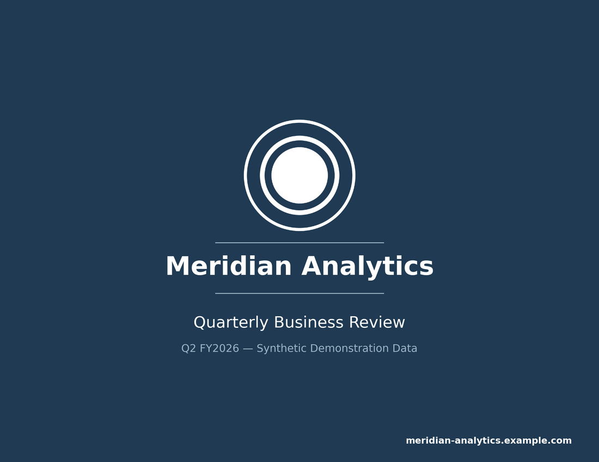
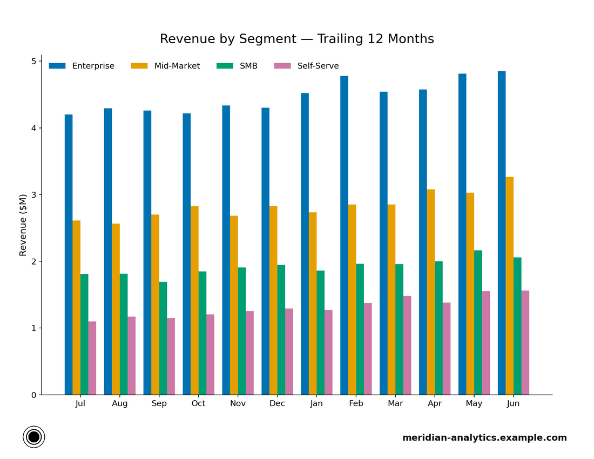
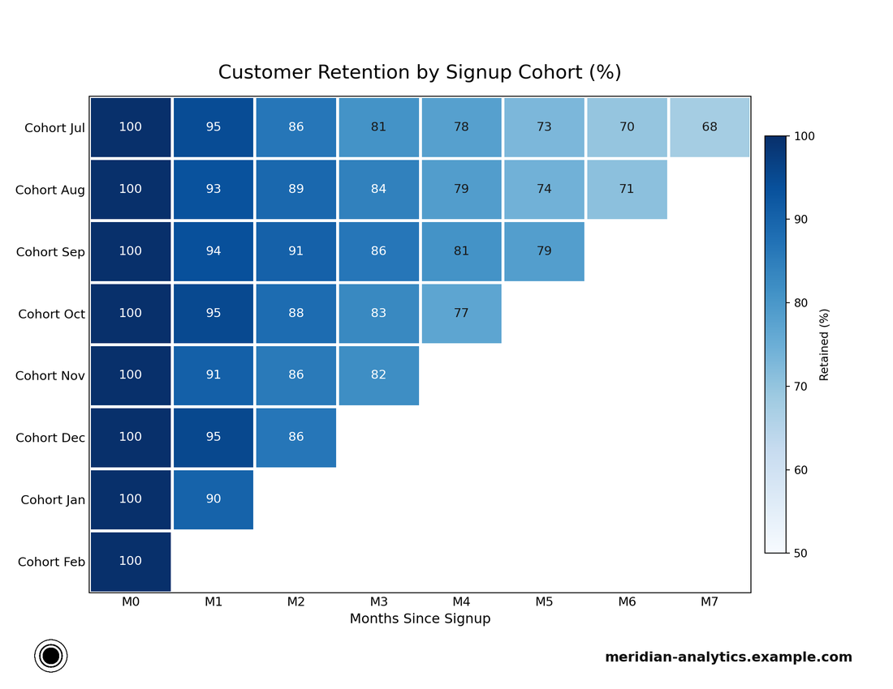

# report-booklet-toolkit

Automate polished, print-safe, hyperlinked multi-page PDF reports at scale. Render each page as a pixel-perfect image with matplotlib (or any renderer that can produce a PNG), then let the toolkit assemble them into a US Letter landscape booklet with a uniform print margin, a branded cover, clickable footer links, and selectable vector page numbers — the same output every time, from a single `write_booklet()` call, whether the run produces one report or a thousand.

[](https://github.com/antoniowilliams123/report-booklet-toolkit/actions/workflows/ci.yml)

## Sample output

Generated end-to-end by [`examples/quarterly_report.py`](examples/quarterly_report.py) from seeded synthetic data — see the full PDF at [`docs/sample/quarterly_report.pdf`](docs/sample/quarterly_report.pdf).

| Cover | Content page | Cohort heatmap |
| --- | --- | --- |
|  |  |  |

Every content page carries the footer band: logo lower-left, `Page X of Y` center, URL lower-right — and in the assembled PDF the logo and URL are clickable link annotations.

## Quickstart

```bash
pip install -e .
python examples/quarterly_report.py --out out/
```

Or build your own booklet:

```python
from pathlib import Path
from booklet import Brand, render_cover, render_text_page, write_booklet

brand = Brand(
    name="Acme Insights",
    url="acme-insights.example.com",
    primary_color="#1f3a52",
    accent_color="#9db4c8",
    logo_path=Path("logo.png"),  # dark mark on transparent background
)

pages = [
    render_cover(Path("p1.png"), brand, title="Monthly Review", subtitle="June 2026"),
    render_text_page(Path("p2.png"), "About", ["Methodology notes..."], brand),
    # ...render content pages with booklet.pages.new_page / content_axes,
    # stamp booklet.footer.draw_footer(fig, brand), save with save_page()...
]
write_booklet(pages, Path("review.pdf"), brand)
```

## What the toolkit handles for you

- **Fixed page geometry** — every page renders at 2112 x 1632 px (US Letter landscape at 192 DPI), so documents open at true size at 100% zoom (`booklet/pages.py`).
- **Branded cover** — solid-color cover with a white logo, wordmark, detail rules, and URL; a recolor helper turns any dark transparent-background logo white while preserving its anti-aliased alpha (`booklet/cover.py`).
- **Text pages** — about/disclaimer pages with wrapped body paragraphs (`booklet/disclaimer.py`).
- **Footer band** — logo, page numbering, and URL in consistent slots on every content page (`booklet/footer.py`).
- **Assembly** — img2pdf layout with a print-safe margin, then a PyMuPDF pass that adds clickable footer links and vector `Page X of Y` text (`booklet/assemble.py`).

## Design decisions

**Raster pages + a vector overlay pass.** Pages are assembled from rendered PNGs rather than drawn natively in PDF. That gives pixel-perfect fidelity from *any* renderer — matplotlib today, a headless browser or a plotting service tomorrow — with zero font-embedding or layout-engine surprises: what you rendered is exactly what ships. What raster pixels cannot carry, a PyMuPDF pass then adds on top of the placed images: clickable link annotations over the footer logo and URL, and `Page X of Y` as real vector text, so page numbers stay selectable and searchable and are always correct even if pages are reordered before assembly.

**A uniform print margin instead of full-bleed.** Consumer printers cannot print to the paper edge; a full-bleed layout gets its edge content — most painfully the footer logo in the corner — clipped on paper. Assembly therefore insets every page image inside a 0.45" left/right and 0.30" top/bottom border with img2pdf's `FitMode.into`. Because the left and right borders are equal, the image is also horizontally centered on the sheet.

**Footer links computed from the placed-image rectangle.** The print margin means the page image no longer coincides with the PDF page. Link rectangles derived from full-page fractions would drift off the footer marks, so the assembly pass locates the actual drawn image via `page.get_image_rects()` and positions every link (and the page number) as a fraction of *that* rectangle. The fractions themselves live in `booklet/footer.py`, next to the code that draws the footer — one source of truth for the geometry.

**Opaque RGB pages by construction.** img2pdf (correctly) refuses images with an alpha channel, so `save_page()` flattens every page to RGB when writing. Renderers can use transparency freely; the assembly input is always valid.

## Development

```bash
pip install -e ".[dev]"
ruff check .
pytest -v
```

Tests assemble a real five-page booklet and verify page count and US Letter dimensions, that placed images respect the print margin and are centered, that footer link annotations point at the brand URL and sit inside the placed image, that page numbers extract as text (and the cover stays unnumbered), and that the cover honors a custom brand color.

## License

MIT — see [LICENSE](LICENSE).
